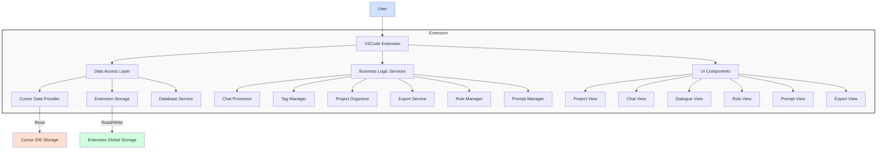

# Cursor Chat Manager - Overview

## 1. Overview

Cursor Chat Manager is a VSCode extension designed to provide enhanced management capabilities for chat history from Cursor IDE. This extension enables users to organize, tag, export, and reuse chat content from Cursor IDE in a more flexible and powerful way than what's natively available.

## 2. Project Structure

```
outputCursorExtension/
│
├── .vscode/                      # VSCode configuration
│   ├── launch.json               # Launch configuration for debugging
│   └── tasks.json                # Task configuration
│
├── src/                          # Source code
│   ├── extension.ts              # Main extension entry point
│   │
│   ├── commands/                 # Command implementations
│   │   ├── projectCommands.ts    # Project folder and organization commands
│   │   ├── exportCommands.ts     # Export functionality (JSON, HTML, text)
│   │   ├── ruleCommands.ts       # Rule management commands
│   │   └── promptCommands.ts     # Prompt management commands
│   │
│   ├── data/                     # Data handling
│   │   ├── cursorDataProvider.ts # Retrieves data from Cursor storage
│   │   ├── storageManager.ts     # Manages extension's global storage
│   │   └── databaseService.ts    # Handles SQLite operations
│   │
│   ├── models/                   # Type definitions
│   │   ├── chat.ts               # Chat data structure
│   │   ├── dialogue.ts           # Individual dialogue entry structure
│   │   ├── project.ts            # Project structure
│   │   ├── rule.ts               # Cursor rule structure
│   │   └── prompt.ts             # Saved prompt structure
│   │
│   ├── services/                 # Business logic
│   │   ├── chatProcessor.ts      # Process and organize chat data
│   │   ├── tagManager.ts         # Handle chat and dialogue-level tags
│   │   ├── projectOrganizer.ts   # Manage custom organization of chats
│   │   ├── exportService.ts      # Handle export to different formats
│   │   ├── ruleManager.ts        # Store, import, and apply rules
│   │   └── promptManager.ts      # Manage saved prompts
│   │
│   ├── utils/                    # Utility functions
│   │   ├── pathUtils.ts          # Path handling for different OS
│   │   ├── fileUtils.ts          # File operations
│   │   └── formatters.ts         # Format conversions
│   │
│   └── views/                    # UI components
│       ├── projectView.ts        # Project explorer view (default + custom)
│       ├── chatView.ts           # Chat display view
│       ├── dialogueView.ts       # Individual dialogue view with tagging
│       ├── ruleView.ts           # Rule management view
│       ├── promptView.ts         # Prompt management view
│       └── exportView.ts         # Export options view
│
├── resources/                    # Static resources
│   ├── icons/                    # Extension icons
│   └── templates/                # Export templates (HTML, etc.)
│
├── documents/                    # Documentation
│   └── module_requirements.md    # This document
│
├── .gitignore                    # Git ignore file
├── package.json                  # Extension manifest
├── tsconfig.json                 # TypeScript configuration
├── webpack.config.js             # Webpack configuration
└── README.md                     # Extension documentation
```

## 3. System Architecture Diagram



## 4. Dependencies

- VSCode Extension API
- SQLite libraries for database access
- Templating engines for HTML export
- YAML parser for .mdc rule handling
- Markdown libraries for text formatting
- UI components for VSCode WebViews

## 5. Cross-Platform Considerations

The extension must account for different operating systems:
- Windows file paths use backslashes and may include spaces
- macOS and Linux use forward slashes in paths
- File permissions may differ across platforms
- Storage locations for Cursor data vary by OS

## 6. Security and Privacy

- The extension must handle user chat data securely
- No data should be transmitted outside the user's system unless explicitly requested
- Export functions should include options to sanitize sensitive information
- Clear privacy policy should be documented

## 7. Future Enhancements

Potential future enhancements to consider:
- Cloud synchronization of custom projects and rules
- Integration with version control systems
- Advanced search capabilities across all chats
- AI-assisted tagging and organization
- Collaborative features for team environments
- Integration with other IDE extensions

## 8. Success Metrics

The success of the extension will be measured by:
- User adoption rate
- Time saved in managing and reusing chat content
- Effectiveness of custom organization compared to default
- User feedback on feature completeness and usability
- Frequency of feature usage (exports, rule management, etc.) 