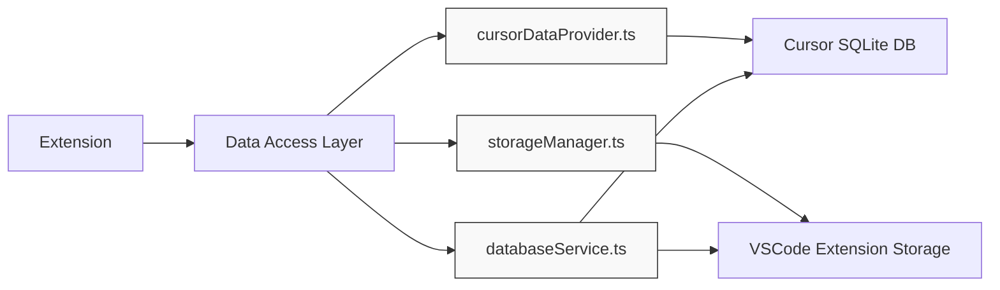
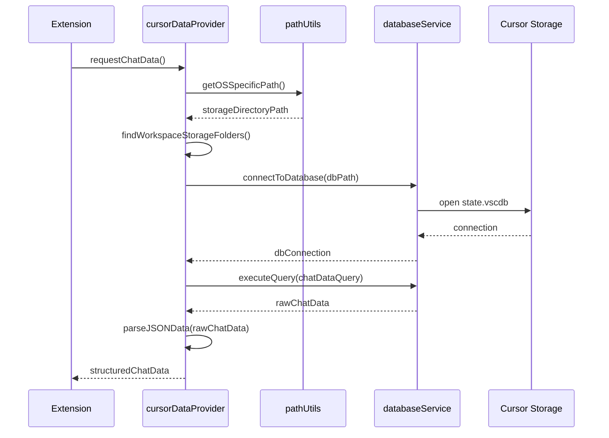
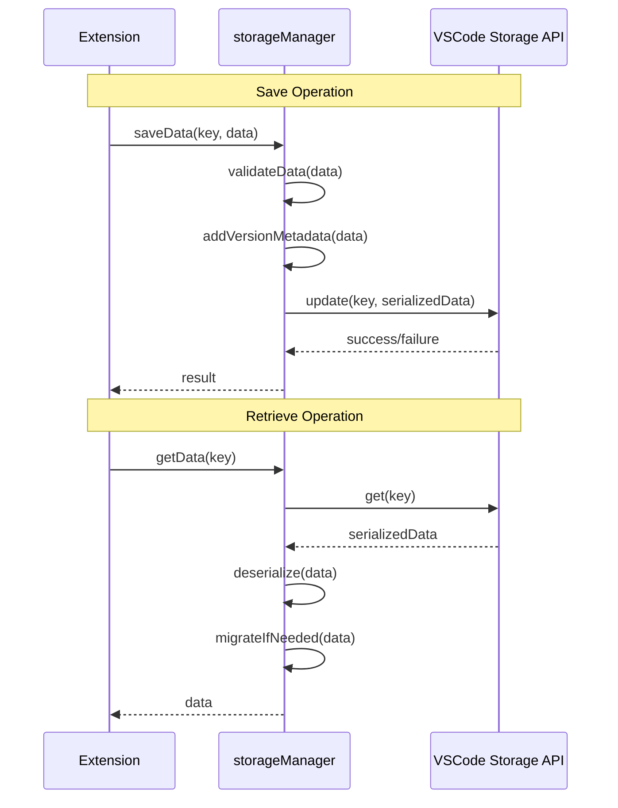
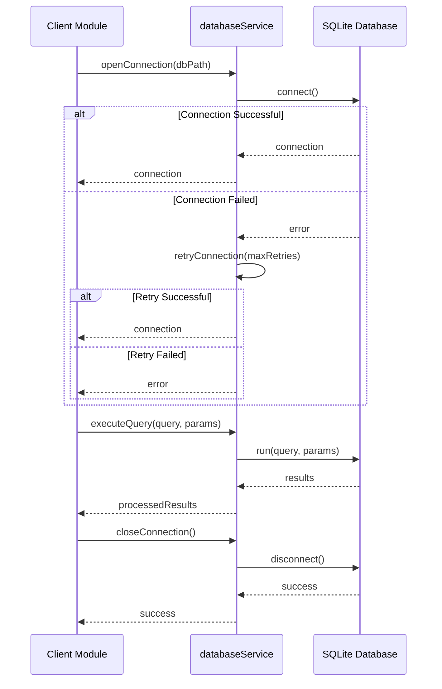

# Data Access Modules

## 1. Data Access Layer Overview

The Data Access Layer is responsible for retrieving data from Cursor IDE's internal storage, handling extension's global storage, and providing database operations for both. This layer ensures proper access to both original Cursor chat data and custom-organized data managed by the extension.

## 2. Detailed Module Specifications

### 2.1 cursorDataProvider.ts
- **Purpose**: Retrieve chat data from Cursor IDE's internal storage
- **Functionality**:
  - Access workspaceStorage directory based on OS (Windows, macOS, Linux)
  - Connect to state.vscdb SQLite databases
  - Extract chat data using SQL queries
  - Parse JSON data from database responses
- **Technical Details**:
  - OS-specific paths:
    - Windows: `%APPDATA%\Cursor\User\workspaceStorage`
    - macOS: `~/Library/Application Support/Cursor/User/workspaceStorage`
    - Linux: `~/.config/Cursor/User/workspaceStorage`
  - SQL queries target keys: `aiService.prompts` and `workbench.panel.aichat.view.aichat.chatdata`
- **Data Access Flow**:

### 2.2 storageManager.ts
- **Purpose**: Manage extension's global storage
- **Functionality**:
  - Store custom project organization
  - Maintain global rules repository
  - Persist user tags and categories
  - Save prompt templates
- **Technical Details**:
  - Use VSCode's extension storage API
  - Implement data versioning for future compatibility
  - Handle synchronization across different workspace sessions
- **Storage Operations Flow**:

### 2.3 databaseService.ts
- **Purpose**: Handle SQLite operations
- **Functionality**:
  - Provide an interface to read from SQLite databases
  - Execute SQL queries to extract chat data
  - Handle database connection errors
- **Technical Details**:
  - Use better-sqlite3 or similar library
  - Implement connection pooling for performance
  - Add error handling and retry mechanisms
- **Database Access Flow**:

