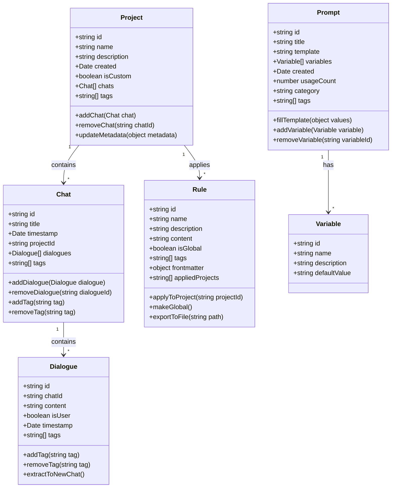

# Data Models

## 1. Data Models Overview

The data models module defines the structure of various entities within the extension, providing type safety and enforcing consistent interfaces. These models represent chats, dialogues, projects, rules, and prompts, forming the foundation for data manipulation throughout the extension.



## 2. Detailed Model Specifications

### 2.1 chat.ts
- **Purpose**: Define chat data structure
- **Functionality**:
  - Model for entire chat conversations
  - Include metadata like timestamps, project associations
  - Store references to component dialogues
  - Maintain chat-level tags
- **Technical Details**:
  - TypeScript interfaces for type safety
  - Methods for serialization/deserialization
- **Sample Interface**:
```typescript
interface Chat {
  id: string;
  title: string;
  timestamp: Date;
  projectId: string;
  dialogues: Dialogue[];
  tags: string[];
  metadata?: Record<string, any>;
  
  addDialogue(dialogue: Dialogue): void;
  removeDialogue(dialogueId: string): boolean;
  addTag(tag: string): void;
  removeTag(tag: string): boolean;
  serialize(): Record<string, any>;
  static deserialize(data: Record<string, any>): Chat;
}
```

### 2.2 dialogue.ts
- **Purpose**: Define individual dialogue entry structure
- **Functionality**:
  - Model for individual messages (user prompts or AI responses)
  - Store dialogue-specific tags
  - Maintain references to parent chat
  - Support extraction for reorganization
- **Technical Details**:
  - TypeScript interfaces
  - Methods for context-aware operations
- **Sample Interface**:
```typescript
interface Dialogue {
  id: string;
  chatId: string;
  content: string;
  isUser: boolean;
  timestamp: Date;
  tags: string[];
  metadata?: Record<string, any>;
  
  addTag(tag: string): void;
  removeTag(tag: string): boolean;
  extractToNewChat(title?: string): Chat;
  serialize(): Record<string, any>;
  static deserialize(data: Record<string, any>): Dialogue;
}
```

### 2.3 project.ts
- **Purpose**: Define project structure
- **Functionality**:
  - Model for both original and custom projects
  - Store references to associated chats
  - Maintain project metadata
- **Technical Details**:
  - Support both native Cursor projects and custom-organized ones
- **Sample Interface**:
```typescript
interface Project {
  id: string;
  name: string;
  description: string;
  created: Date;
  isCustom: boolean;
  chats: Chat[];
  tags: string[];
  metadata?: Record<string, any>;
  
  addChat(chat: Chat): void;
  removeChat(chatId: string): boolean;
  updateMetadata(metadata: Record<string, any>): void;
  serialize(): Record<string, any>;
  static deserialize(data: Record<string, any>): Project;
}
```

### 2.4 rule.ts
- **Purpose**: Define Cursor rule structure
- **Functionality**:
  - Model for .mdc rules
  - Store rule content and metadata
  - Support tagging and categorization
- **Technical Details**:
  - Support YAML frontmatter parsing
  - Methods for rule application
- **Sample Interface**:
```typescript
interface Rule {
  id: string;
  name: string;
  description: string;
  content: string;
  isGlobal: boolean;
  tags: string[];
  frontmatter: Record<string, any>;
  appliedProjects: string[];
  
  applyToProject(projectId: string): boolean;
  makeGlobal(): void;
  exportToFile(path: string): Promise<boolean>;
  serialize(): Record<string, any>;
  static deserialize(data: Record<string, any>): Rule;
  static fromMDCFile(filePath: string): Promise<Rule>;
}
```

### 2.5 prompt.ts
- **Purpose**: Define saved prompt structure
- **Functionality**:
  - Model for reusable prompt templates
  - Support variable templating
  - Track usage statistics
  - Maintain tags and categories
- **Technical Details**:
  - Template variable parsing
  - Serialization for storage
- **Sample Interface**:
```typescript
interface Variable {
  id: string;
  name: string;
  description: string;
  defaultValue: string;
}

interface Prompt {
  id: string;
  title: string;
  template: string;
  variables: Variable[];
  created: Date;
  usageCount: number;
  category: string;
  tags: string[];
  
  fillTemplate(values: Record<string, string>): string;
  addVariable(variable: Variable): void;
  removeVariable(variableId: string): boolean;
  incrementUsage(): void;
  serialize(): Record<string, any>;
  static deserialize(data: Record<string, any>): Prompt;
}
``` 