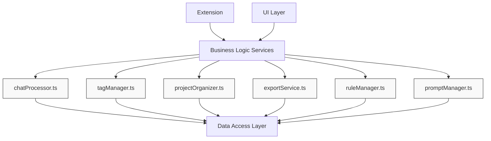
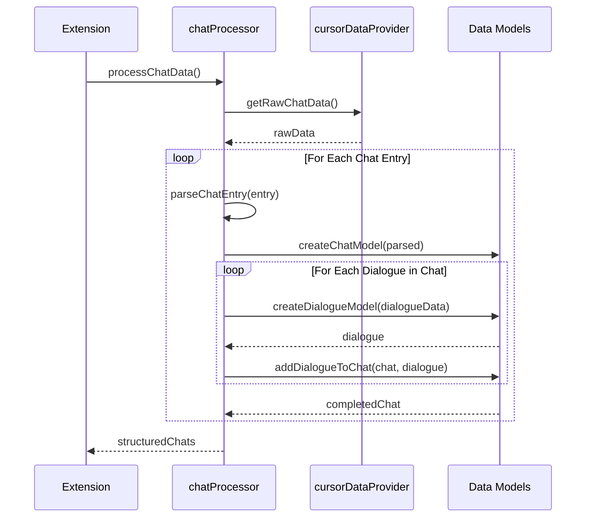
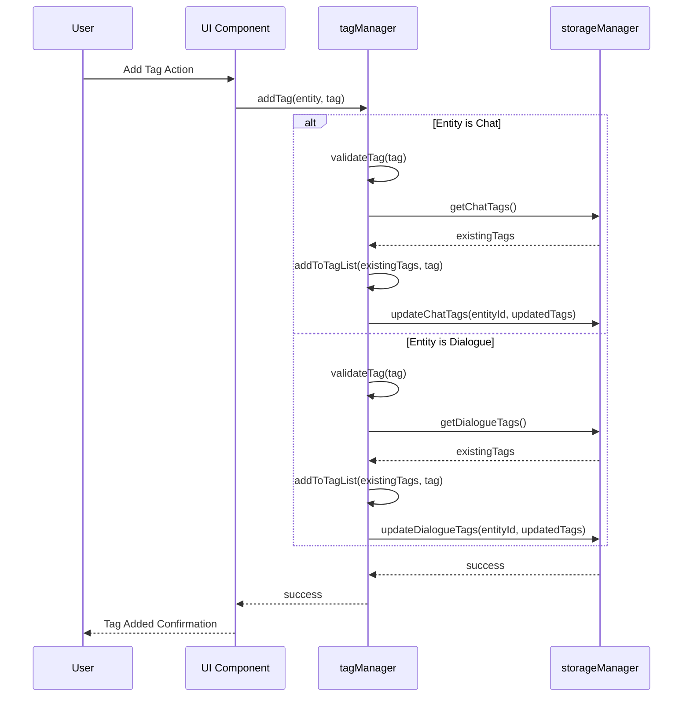
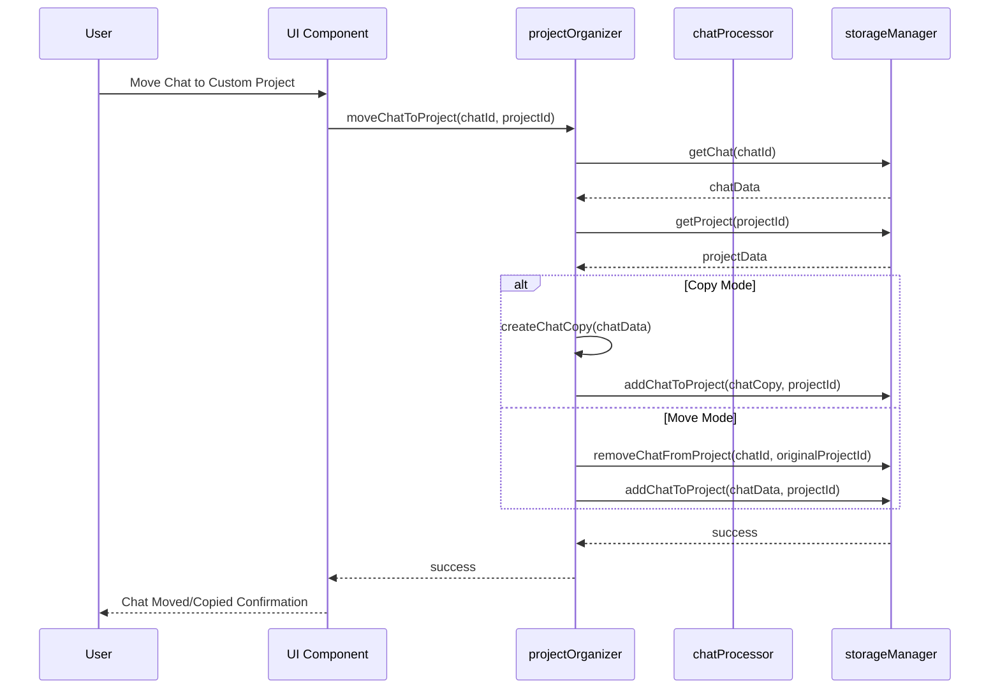
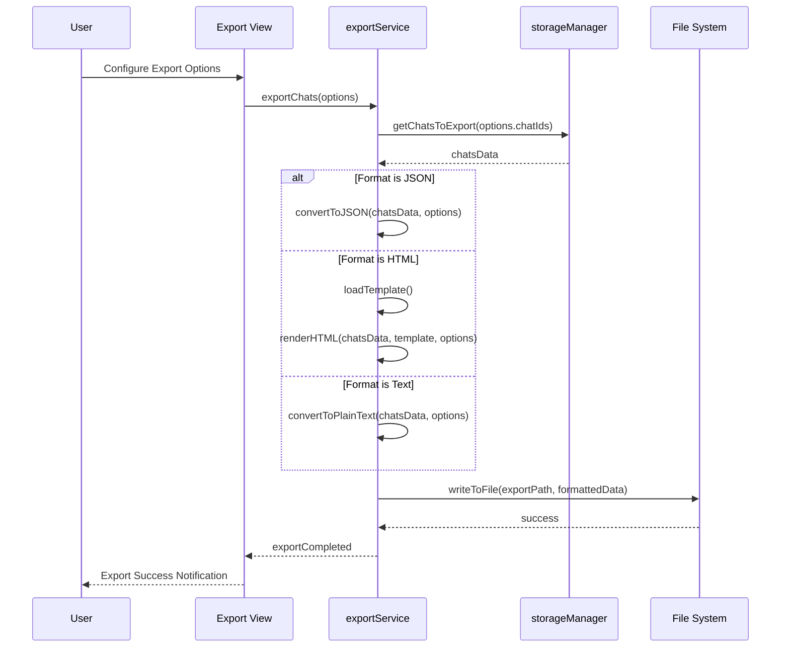
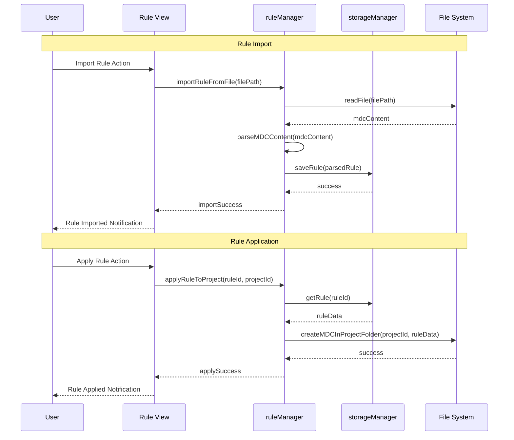
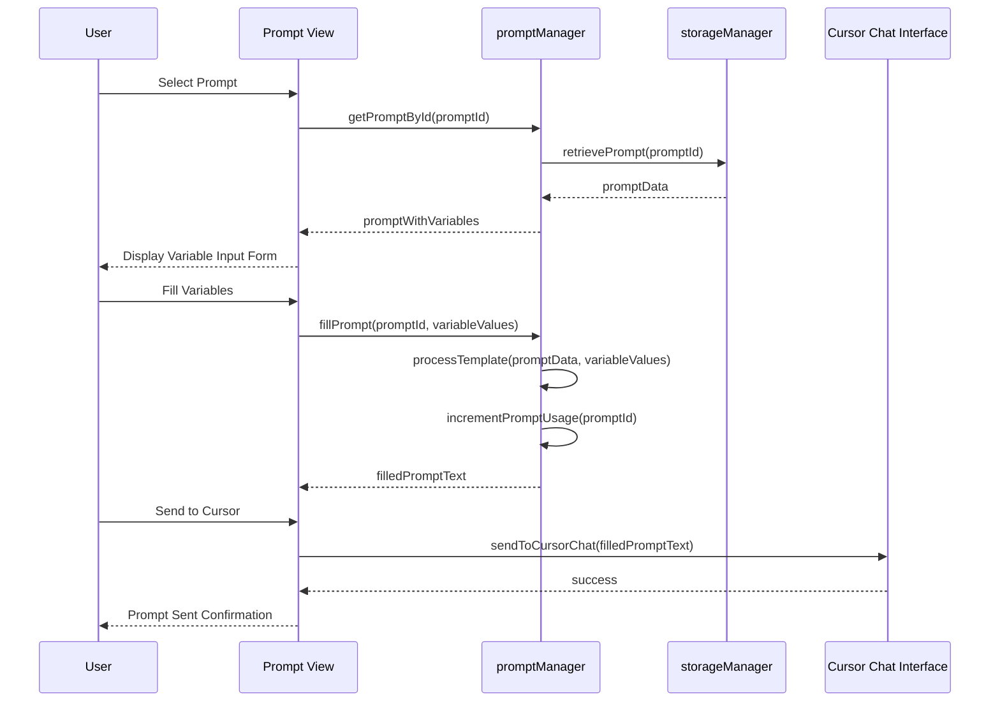

# Business Logic Services

## 1. Services Overview

The services layer implements the core business logic of the extension, providing functionality to process, organize, and manage chats, tags, projects, exports, rules, and prompts. This layer sits between the data access layer and the UI components, orchestrating complex operations and enforcing business rules.

## 2. Detailed Service Specifications

### 2.1 chatProcessor.ts
- **Purpose**: Process and organize chat data
- **Functionality**:
  - Parse raw chat data from Cursor
  - Convert into structured chat and dialogue models
  - Handle relationships between chats and projects
- **Technical Details**:
  - Implement parsing algorithms for Cursor's chat format
  - Error handling for malformed data
- **Processing Flow**:

### 2.2 tagManager.ts
- **Purpose**: Handle chat and dialogue-level tags
- **Functionality**:
  - Provide two-level tagging system
  - Implement tag CRUD operations
  - Support filtering and searching by tags
  - Manage tag categories and relationships
- **Technical Details**:
  - Efficient tag storage and retrieval
  - Tag suggestion algorithms
- **Tagging Operations Flow**:

### 2.3 projectOrganizer.ts
- **Purpose**: Manage custom organization of chats
- **Functionality**:
  - Create custom projects
  - Move or copy chats between projects
  - Extract individual dialogues to custom projects
  - Maintain references to original chat sources
- **Technical Details**:
  - Preserve original data integrity
  - Implement efficient reference system
- **Chat Organization Flow**:

### 2.4 exportService.ts
- **Purpose**: Handle export to different formats
- **Functionality**:
  - Export chats to JSON format
  - Generate HTML exports with styling
  - Create plain text exports
  - Support customization options for each format
- **Technical Details**:
  - Templating system for HTML exports
  - JSON schema design
  - Markdown conversion options
- **Export Process Flow**:

### 2.5 ruleManager.ts
- **Purpose**: Store, import, and apply rules
- **Functionality**:
  - Manage global rule repository
  - Import rules from projects
  - Export rules to projects
  - Apply rules across projects
- **Technical Details**:
  - .mdc file parsing and creation
  - Rule application mechanisms
  - Integration with Cursor's rule system
- **Rule Management Flow**:

### 2.6 promptManager.ts
- **Purpose**: Manage saved prompts
- **Functionality**:
  - Store reusable prompt templates
  - Support variable templating
  - Organize prompts by tags and categories
  - Track prompt usage statistics
- **Technical Details**:
  - Template variable parsing and application
  - Integration with Cursor's chat interface
- **Prompt Usage Flow**:

