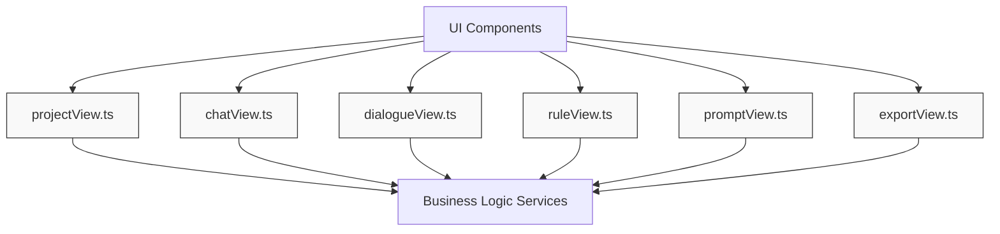
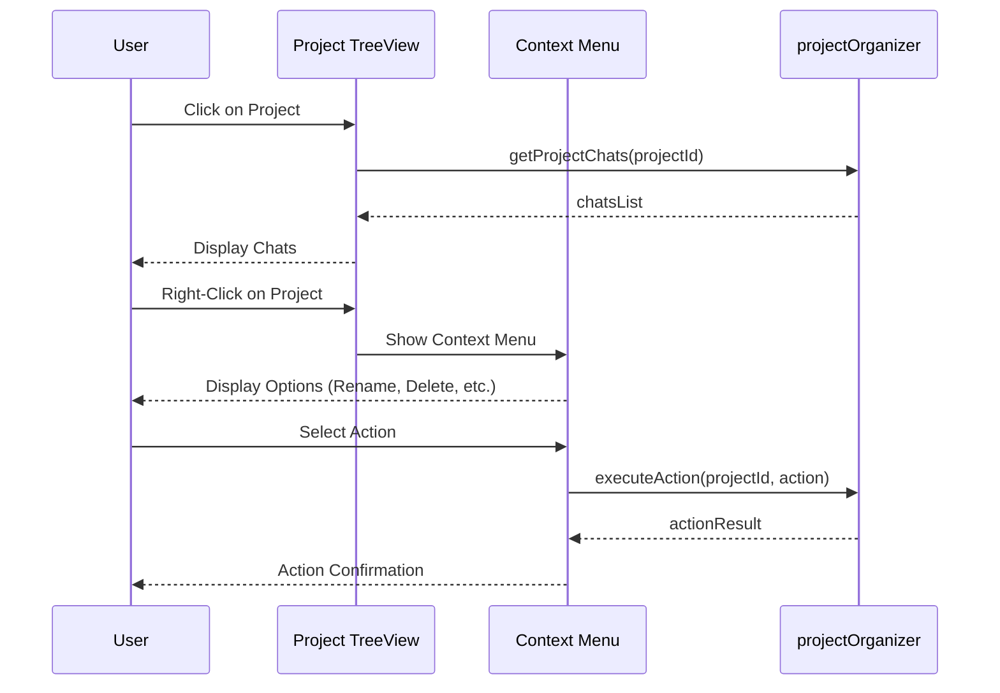
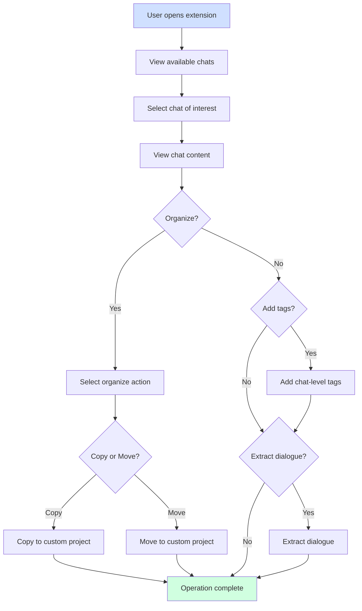
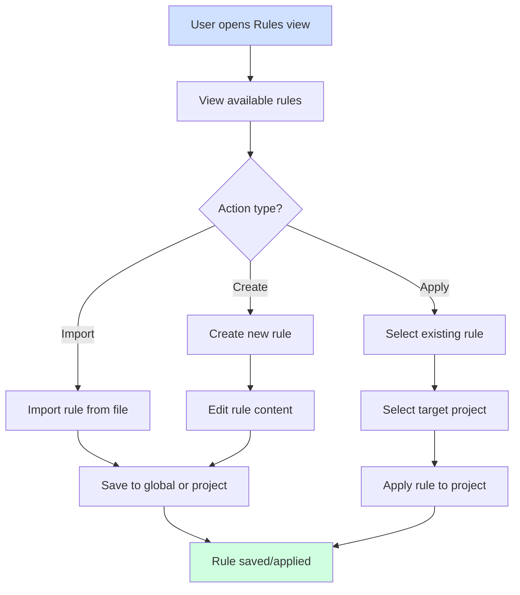
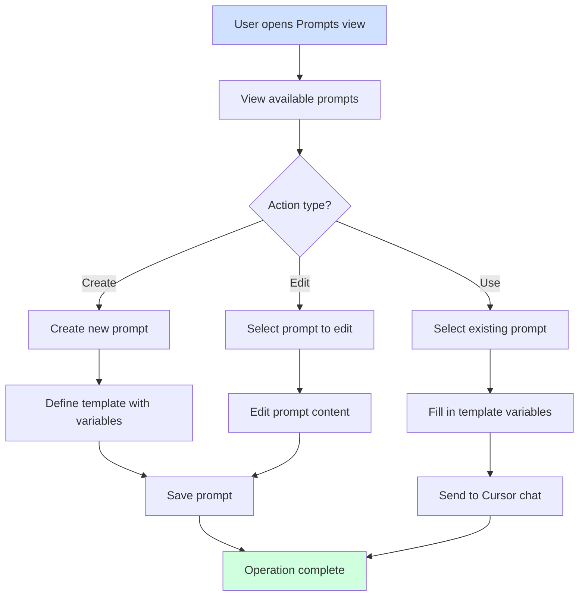

# User Interface Components

## 1. UI Components Overview

The UI components of the extension provide the visual interface for users to interact with the functionality. The views are built using VSCode's extension UI APIs, primarily using TreeViews for navigation and WebViews for rich content display. Each component is designed to provide intuitive access to the extension's features while following VSCode's design patterns.



## 2. Activity Bar View Container

The main entry point to the extension's UI is through the Activity Bar View Container, which provides access to all the extension's features through a vertical tab organization.

```
┌──────────────────────────────────────────┐
│ Cursor Manager                           │
├──────────────────────────────────────────┤
│                                          │
│ ┌────────────────────────────────────┐   │
│ │ Projects                      [⇄]  │   │
│ │ ├─ Original                        │   │
│ │ │  ├─ Project 1                    │   │
│ │ │  │  └─ Chats (3)                │   │
│ │ │  └─ Project 2                    │   │
│ │ │     └─ Chats (5)                │   │
│ │ │                                  │   │
│ │ └─ Custom                          │   │
│ │    ├─ Frontend Best Practices      │   │
│ │    │  └─ Chats (2)                │   │
│ │    └─ Database Patterns            │   │
│ │       └─ Chats (3)                │   │
│ │    └─ + New Custom Project        │   │
│ │                                    │   │
│ └────────────────────────────────────┘   │
│                                          │
│ ┌────────────────────────────────────┐   │
│ │ Rules                         [⇄]  │   │
│ │ ├─ Global Rules                     │   │
│ │ │  ├─ Code Rules                    │   │
│ │ │  └─ Documentation                 │   │
│ │ └─ Project Rules                    │   │
│ │    └─ Current Project               │   │
│ │       └─ + Import Rule              │   │
│ │                                     │   │
│ └────────────────────────────────────┘   │
│                                          │
│ ┌────────────────────────────────────┐   │
│ │ Tags                          [⇄]  │   │
│ │ ├─ Chat Tags                        │   │
│ │ │  ├─ #frontend                     │   │
│ │ │  ├─ #backend                      │   │
│ │ │  └─ + Add Tag                     │   │
│ │ └─ Dialogue Tags                    │   │
│ │    ├─ #code-example                 │   │
│ │    ├─ #explanation                  │   │
│ │    └─ + Add Tag                     │   │
│ │                                     │   │
│ └────────────────────────────────────┘   │
│                                          │
│ ┌────────────────────────────────────┐   │
│ │ Prompts                       [⇄]  │   │
│ │ ├─ Code Generation                  │   │
│ │ │  ├─ React Component               │   │
│ │ │  └─ API Endpoint                  │   │
│ │ ├─ Documentation                    │   │
│ │ │  ├─ Function Doc                  │   │
│ │ │  └─ README Template               │   │
│ │ └─ + New Prompt                     │   │
│ │                                     │   │
│ └────────────────────────────────────┘   │
│                                          │
└──────────────────────────────────────────┘
```

This container includes TreeViews for:
- Projects (both original Cursor projects and custom-organized ones)
- Rules (global and project-specific)
- Tags (organized by chat and dialogue levels)
- Prompts (organized by categories)

## 3. UI Component Details

### 3.1 projectView.ts
- **Purpose**: Project explorer view
- **Functionality**:
  - Display both original and custom projects
  - Show project hierarchies and chat listings
  - Provide context menus for actions
- **Technical Details**:
  - VSCode TreeView implementation
  - Context menu registration
- **User Interaction Flow**:



### 3.2 chatView.ts
- **Purpose**: Chat display view
- **Functionality**:
  - Render chat conversations
  - Show chat-level metadata and tags
  - Provide chat-level actions
- **Technical Details**:
  - VSCode WebView implementation
  - Message passing between extension and WebView
- **UI Mockup**:

```
┌───────────────────────────────────────────────────┐
│ Chat History - Project: Frontend Development       │
├───────────────────────────────────────────────────┤
│ 🔍 Search...              │ Filter: Chat Tags ▼    │
├───────────────────────────────────────────────────┤
│ ┌─────────────────────────────────────────────┐   │
│ │ Apr 15, 2023 - Component Architecture       │   │
│ │ Chat Tags: #frontend #react                 │   │
│ │                                             │   │
│ │ [User] I need help with React components... │   │
│ │ Tags: #question #architecture               │   │
│ │ 🏷️ Add Tag  📋 Copy  ↪️ Extract              │   │
│ │                                             │   │
│ │ [AI] Here's how you can structure...        │   │
│ │ Tags: #code-example #best-practice          │   │
│ │ 🏷️ Add Tag  📋 Copy  ↪️ Extract  💾 Save Rule │   │
│ │                                             │   │
│ │ ✂️ Export Chat  🗂️ Move to Project  🏷️ Tags   │   │
│ └─────────────────────────────────────────────┘   │
│                                                   │
│ ┌─────────────────────────────────────────────┐   │
│ │ Apr 12, 2023 - API Integration              │   │
│ │ Chat Tags: #backend #api                    │   │
│ │                                             │   │
│ │ [User] How do I connect to the API?         │   │
│ │ Tags: #question                             │   │
│ │ 🏷️ Add Tag  📋 Copy  ↪️ Extract              │   │
│ │                                             │   │
│ │ [AI] You can use fetch or axios...          │   │
│ │ Tags: #code-example                         │   │
│ │ 🏷️ Add Tag  📋 Copy  ↪️ Extract  💾 Save Rule │   │
│ │                                             │   │
│ │ ✂️ Export Chat  🗂️ Move to Project  🏷️ Tags   │   │
│ └─────────────────────────────────────────────┘   │
│                                                   │
└───────────────────────────────────────────────────┘
```

### 3.3 dialogueView.ts
- **Purpose**: Individual dialogue view
- **Functionality**:
  - Display individual messages
  - Show dialogue-level tags
  - Provide dialogue-specific actions
- **Technical Details**:
  - Integration with chatView
  - Action buttons and context menus
- **Extract Dialogue UI Mockup**:

```
┌───────────────────────────────────────────┐
│ Extract Dialogue                          │
├───────────────────────────────────────────┤
│ Selected dialogue:                        │
│ ┌─────────────────────────────────────┐   │
│ │ [AI] Here's how you can implement   │   │
│ │ a custom hook for form validation:  │   │
│ │ ```                                 │   │
│ │ function useFormValidation() {      │   │
│ │   // code example here              │   │
│ │ }                                   │   │
│ │ ```                                 │   │
│ └─────────────────────────────────────┘   │
│                                           │
│ Extract to:                              │
│ ○ New Chat in Current Project            │
│ ⦿ Existing Custom Project:               │
│   [React Hooks and Examples      ▼]      │
│ ○ New Custom Project:                    │
│   [                              ]       │
│                                          │
│ Add Tags: #react #hooks #form-validation │
│                                          │
│ [   Cancel   ]       [   Extract   ]     │
└───────────────────────────────────────────┘
```

### 3.4 ruleView.ts
- **Purpose**: Rule management view
- **Functionality**:
  - Display global and project rules
  - Provide rule editing interface
  - Show rule application options
- **Technical Details**:
  - Rule editor with syntax highlighting
  - Rule application UI
- **Rule Management UI Mockup**:

```
┌───────────────────────────────────────────────────┐
│ Rule Management                                   │
├───────────────────────────────────────────────────┤
│ ┌─────────────────────┐ ┌─────────────────────┐   │
│ │ Global Rules        │ │ Project Rules       │   │
│ │                     │ │                     │   │
│ │ ● Code Standards    │ │ ● Project Specific  │   │
│ │ ● Documentation     │ │ ● Team Guidelines   │   │
│ │ ● Testing           │ │                     │   │
│ │                     │ │                     │   │
│ └─────────────────────┘ └─────────────────────┘   │
│                                                   │
│ ┌─────────────────────────────────────────────┐   │
│ │ Rule: Code Standards                        │   │
│ │ Tags: #coding #standards                    │   │
│ │                                             │   │
│ │ Description: Enforces team code standards   │   │
│ │                                             │   │
│ │ Apply to current project                    │   │
│ │                                             │   │
│ │ [Preview Rule Content]                      │   │
│ │                                             │   │
│ │ 💾 Save to Project  🌐 Make Global  ✏️ Edit  │   │
│ └─────────────────────────────────────────────┘   │
│                                                   │
└───────────────────────────────────────────────────┘
```

### 3.5 promptView.ts
- **Purpose**: Prompt management view
- **Functionality**:
  - Display saved prompts
  - Provide prompt editing interface
  - Support template variable filling
- **Technical Details**:
  - Template editor
  - Variable input UI
  - Integration with Cursor chat
- **Prompt Management UI Mockup**:

```
┌───────────────────────────────────────────────────┐
│ Prompt Management                                 │
├───────────────────────────────────────────────────┤
│ 🔍 Search prompts...         │ Filter by tag ▼    │
├───────────────────────────────────────────────────┤
│ ┌─────────────────────────────────────────────┐   │
│ │ React Component Generator                   │   │
│ │ Tags: #react #component #frontend           │   │
│ │                                             │   │
│ │ Create a React functional component named   │   │
│ │ {{componentName}} with TypeScript props     │   │
│ │ interface that includes {{propDetails}}.    │   │
│ │ The component should {{functionality}}.     │   │
│ │                                             │   │
│ │ 📋 Copy  🖊️ Edit  🚀 Use in Chat  🗑️ Delete  │   │
│ └─────────────────────────────────────────────┘   │
│                                                   │
│ ┌─────────────────────────────────────────────┐   │
│ │ API Documentation Template                  │   │
│ │ Tags: #api #documentation                   │   │
│ │                                             │   │
│ │ Document the {{endpointName}} API endpoint  │   │
│ │ with details on request parameters,         │   │
│ │ response format, and error codes.           │   │
│ │ Include example requests and responses.     │   │
│ │                                             │   │
│ │ 📋 Copy  🖊️ Edit  🚀 Use in Chat  🗑️ Delete  │   │
│ └─────────────────────────────────────────────┘   │
│                                                   │
│ [   + New Prompt   ]  [   Import/Export   ]       │
└───────────────────────────────────────────────────┘
```

**Create/Edit Prompt Dialog**:

```
┌───────────────────────────────────────────────────┐
│ Create New Prompt                                 │
├───────────────────────────────────────────────────┤
│ Title:                                            │
│ [Code Review Checklist                     ]      │
│                                                   │
│ Category:                                         │
│ [Code Quality                       ] [+ New]     │
│                                                   │
│ Tags:                                             │
│ [#code-review #quality #checklist           ]     │
│                                                   │
│ Prompt Template:                                  │
│ ┌─────────────────────────────────────────────┐   │
│ │ Review the following {{language}} code for: │   │
│ │ - Performance issues                        │   │
│ │ - Security vulnerabilities                  │   │
│ │ - Code style consistency                    │   │
│ │ - Possible bugs or edge cases               │   │
│ │ - Documentation completeness                │   │
│ │                                             │   │
│ │ {{code}}                                    │   │
│ │                                             │   │
│ └─────────────────────────────────────────────┘   │
│                                                   │
│ Template Variables:                               │
│ - {{language}}: Programming language              │
│ - {{code}}: The code to review                    │
│ [+ Add Variable]                                  │
│                                                   │
│ [   Cancel   ]           [   Save Prompt   ]      │
└───────────────────────────────────────────────────┘
```

**Use Prompt Dialog**:

```
┌───────────────────────────────────────────────────┐
│ Use Prompt: React Component Generator             │
├───────────────────────────────────────────────────┤
│ Fill in the template variables:                   │
│                                                   │
│ componentName:                                    │
│ [UserProfileCard                         ]        │
│                                                   │
│ propDetails:                                      │
│ [user data, display options, and callback ]       │
│ [functions for user interactions          ]       │
│                                                   │
│ functionality:                                    │
│ [display user profile information with    ]       │
│ [customizable appearance and support for  ]       │
│ [click events on different elements       ]       │
│                                                   │
│ Preview:                                          │
│ ┌─────────────────────────────────────────────┐   │
│ │ Create a React functional component named   │   │
│ │ UserProfileCard with TypeScript props       │   │
│ │ interface that includes user data, display  │   │
│ │ options, and callback functions for user    │   │
│ │ interactions. The component should display  │   │
│ │ user profile information with customizable  │   │
│ │ appearance and support for click events on  │   │
│ │ different elements.                         │   │
│ └─────────────────────────────────────────────┘   │
│                                                   │
│ [   Cancel   ]     [   Send to Cursor   ]         │
└───────────────────────────────────────────────────┘
```

### 3.6 exportView.ts
- **Purpose**: Export options view
- **Functionality**:
  - Provide export format selection
  - Show customization options
  - Handle export destination
- **Technical Details**:
  - Format-specific options
  - File save dialog integration
- **Export Dialog UI Mockup**:

```
┌───────────────────────────────────────────┐
│ Export Chat History                       │
├───────────────────────────────────────────┤
│ Format:                                   │
│ ○ HTML  ● JSON  ○ Text                    │
│                                           │
│ Export Location:                          │
│ [/user/documents/exports            ] 📁  │
│                                           │
│ Options:                                  │
│ ☑ Include metadata                        │
│ ☑ Include timestamps                      │
│ ☐ Only export selected conversations      │
│ ☑ Include tags                            │
│                                           │
│ [  Cancel  ]           [  Export  ]       │
└───────────────────────────────────────────┘
```

## 4. Project Organization Panel

The Project Organization Panel allows users to reorganize chats across projects, providing a dedicated interface for custom organization.

```
┌───────────────────────────────────────────────────┐
│ Project Organization                              │
├───────────────────────────────────────────────────┤
│ ┌─────────────────────┐ ┌─────────────────────┐   │
│ │ Available Chats     │ │ Target Project      │   │
│ │                     │ │                     │   │
│ │ Project 1           │ │ Frontend Patterns   │   │
│ │  ├ Chat 1           │ │  ├ React Hooks      │   │
│ │  │  ├ Dialogue 1    │ │  └ Component Design │   │
│ │  │  └ Dialogue 2    │ │                     │   │
│ │  └ Chat 2           │ │ + Add Selected      │   │
│ │     └ Dialogue 1    │ │   Items   →         │   │
│ │                     │ │                     │   │
│ │ Project 2           │ │ ← Remove            │   │
│ │  └ Chat 1           │ │   Selected Items    │   │
│ │     └ Dialogue 3    │ │                     │   │
│ │                     │ │                     │   │
│ │ Filter by Tags: ▼   │ │ + New Project       │   │
│ │                     │ │                     │   │
│ └─────────────────────┘ └─────────────────────┘   │
│                                                   │
│ Options:                                          │
│ ⦿ Copy chats (keep original)                      │
│ ⚪ Move chats (remove from original)               │
│                                                   │
│ [   Cancel   ]            [   Apply   ]           │
└───────────────────────────────────────────────────┘
```

## 5. Key User Workflows

### 5.1 Chat Organization Workflow



### 5.2 Rule Management Workflow



### 5.3 Prompt Usage Workflow

