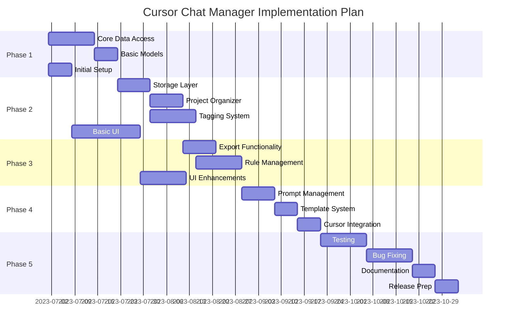
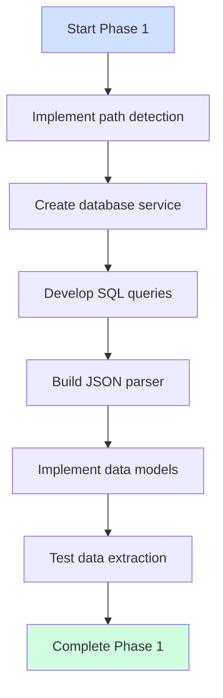
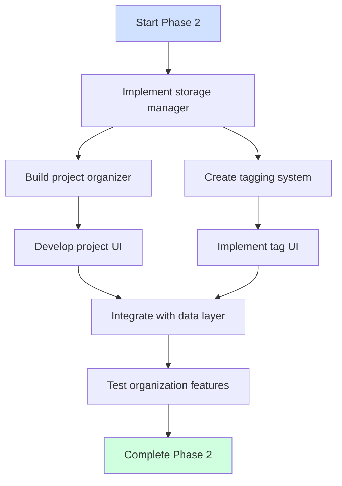
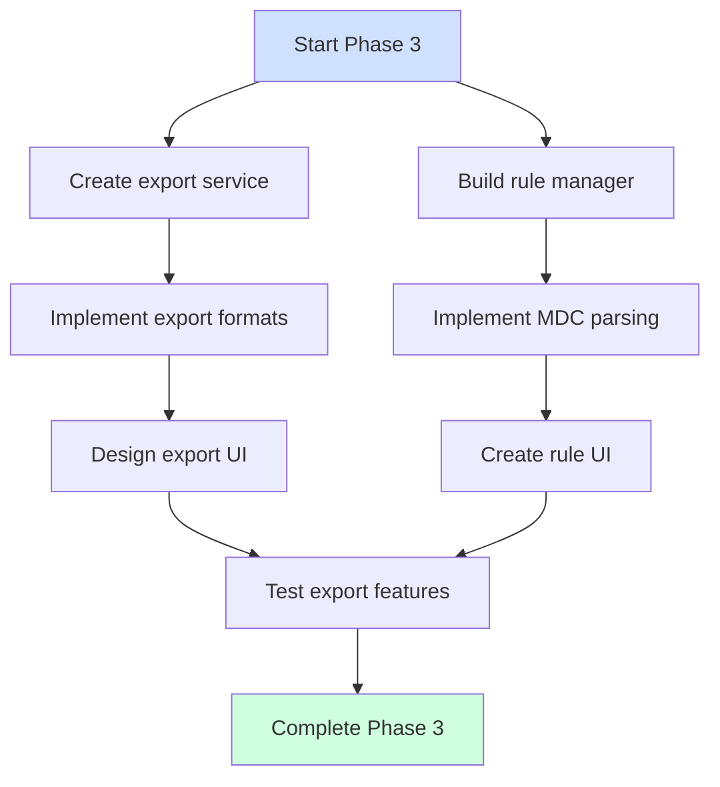
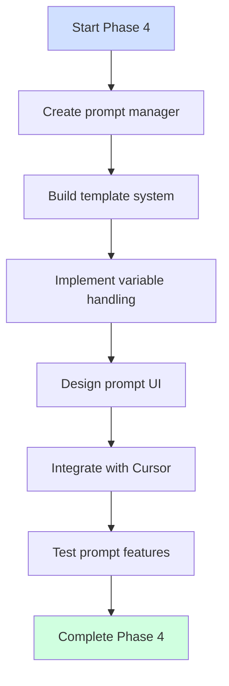
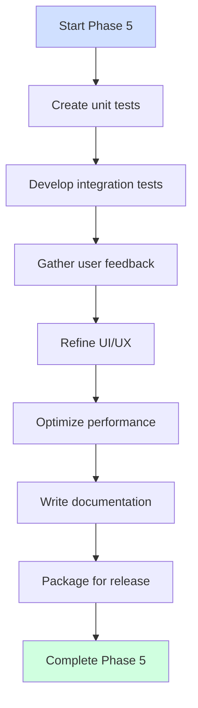
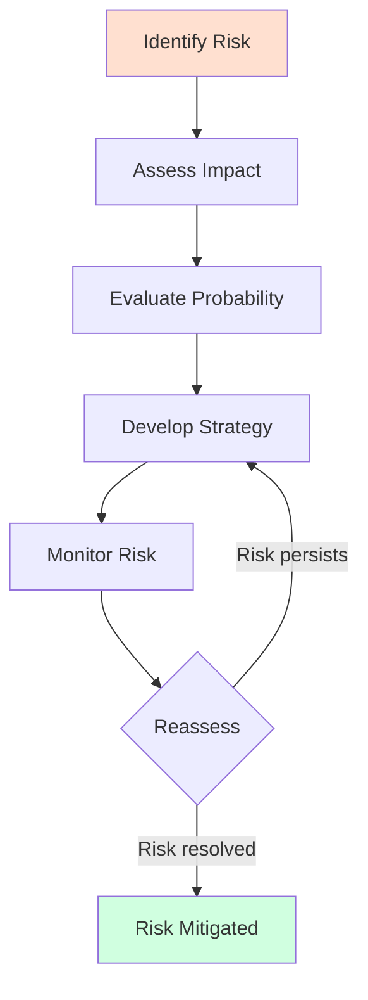
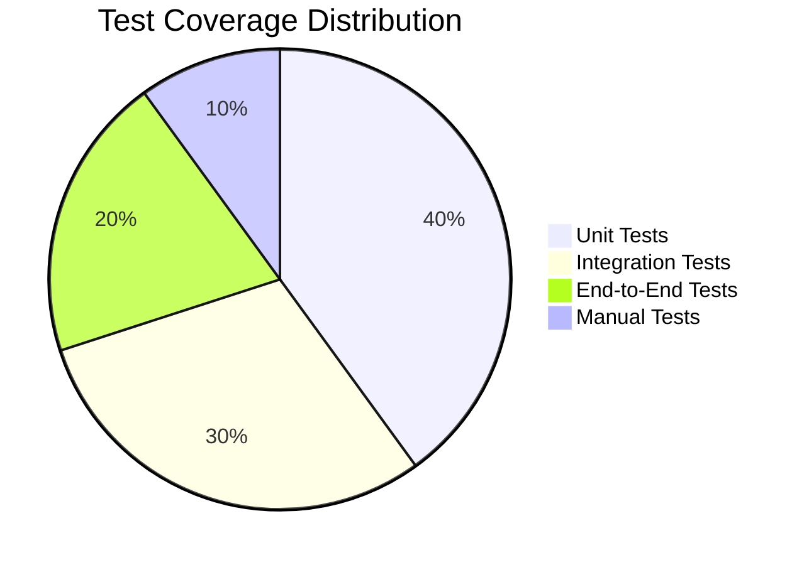
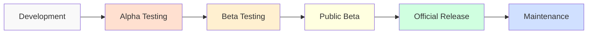
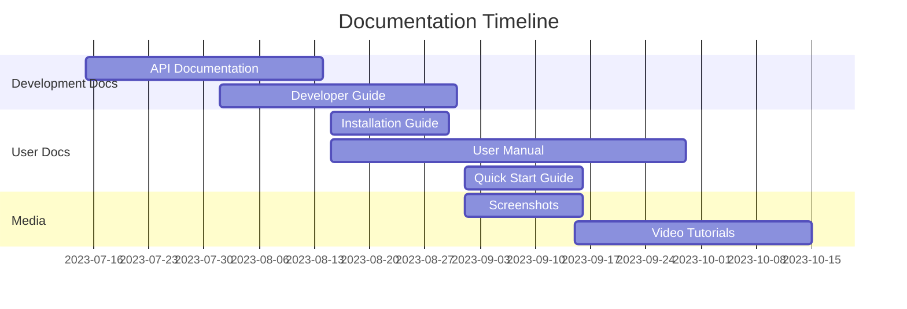

# Implementation Plan

## 1. Implementation Strategy Overview

The implementation of the Cursor Chat Manager extension will follow a phased approach, with each phase building upon the previous ones to incrementally add functionality. This approach allows for early testing of core components and provides opportunities to gather feedback as the extension is developed.

## 2. Phase Details

### 2.1 Phase 1: Core Data Access
- **Objective**: Establish core functionality to access and extract Cursor chat data
- **Key Tasks**:
  - Implement OS-specific path detection for Cursor's storage
  - Create database service for SQLite operations
  - Build chat data extraction functionality
  - Develop basic models for chats and dialogues
- **Deliverables**:
  - Working data access layer
  - Ability to read chat data from Cursor's storage
  - Basic chat and dialogue data models
- **Timeline**: 3 weeks

**Implementation Plan**:

### 2.2 Phase 2: Custom Storage and Organization
- **Objective**: Create storage solution and custom organization capabilities
- **Key Tasks**:
  - Implement extension's global storage
  - Create project organizer service
  - Build two-level tagging system
  - Develop UI for project and tag management
- **Deliverables**:
  - Storage system for extension data
  - Project organization functionality
  - Tagging system at chat and dialogue levels
  - Basic UI for management
- **Timeline**: 4 weeks

**Implementation Plan**:

### 2.3 Phase 3: Export and Rule Management
- **Objective**: Add export capabilities and rule management
- **Key Tasks**:
  - Implement export service for different formats
  - Create rule management functionality
  - Develop UI for rule imports and exports
  - Build rule application mechanisms
- **Deliverables**:
  - Export functionality for JSON, HTML, and text
  - Rule management system
  - UI for rule manipulation
- **Timeline**: 4 weeks

**Implementation Plan**:

### 2.4 Phase 4: Prompt Management
- **Objective**: Implement prompt template system
- **Key Tasks**:
  - Implement prompt template system
  - Create prompt categorization and tagging
  - Build UI for prompt management
  - Develop integration with Cursor's chat interface
- **Deliverables**:
  - Prompt management system
  - Template variable support
  - Cursor chat integration
- **Timeline**: 3 weeks

**Implementation Plan**:

### 2.5 Phase 5: Testing and Refinement
- **Objective**: Test, refine, and prepare for release
- **Key Tasks**:
  - Write unit and integration tests
  - Gather user feedback
  - Refine UI and UX
  - Optimize performance
  - Prepare for initial release
- **Deliverables**:
  - Fully tested extension
  - Optimized performance
  - Comprehensive documentation
  - Release package
- **Timeline**: 6 weeks

**Implementation Plan**:

## 3. Risk Assessment and Mitigation

### 3.1 Potential Risks

| Risk | Impact | Probability | Mitigation Strategy |
|------|--------|------------|---------------------|
| Changes to Cursor's data structure | High | Medium | Design adaptable data access layer with abstraction |
| Performance issues with large chat histories | Medium | Medium | Implement pagination and lazy loading |
| VSCode API limitations | Medium | Low | Research alternatives and workarounds early |
| Cross-platform compatibility issues | Medium | Medium | Test on all target platforms throughout development |
| User experience complexity | High | Medium | Conduct early usability testing and iterate |

### 3.2 Mitigation Plan

## 4. Testing Strategy

### 4.1 Testing Approach
- Unit testing for individual components
- Integration testing for component interactions
- End-to-end testing for user workflows
- Cross-platform testing (Windows, macOS, Linux)
- User acceptance testing with beta testers

### 4.2 Test Coverage

## 5. Release Strategy

### 5.1 Release Phases
1. **Alpha**: Internal testing with development team
2. **Beta**: Limited release to selected users
3. **Public Beta**: Open release with clear beta status
4. **Official Release**: Full public release
5. **Maintenance**: Regular updates and bug fixes

### 5.2 Release Process

## 6. Documentation Plan

### 6.1 Documentation Types
- Installation guide
- User manual
- API documentation
- Developer documentation
- Video tutorials

### 6.2 Documentation Timeline

