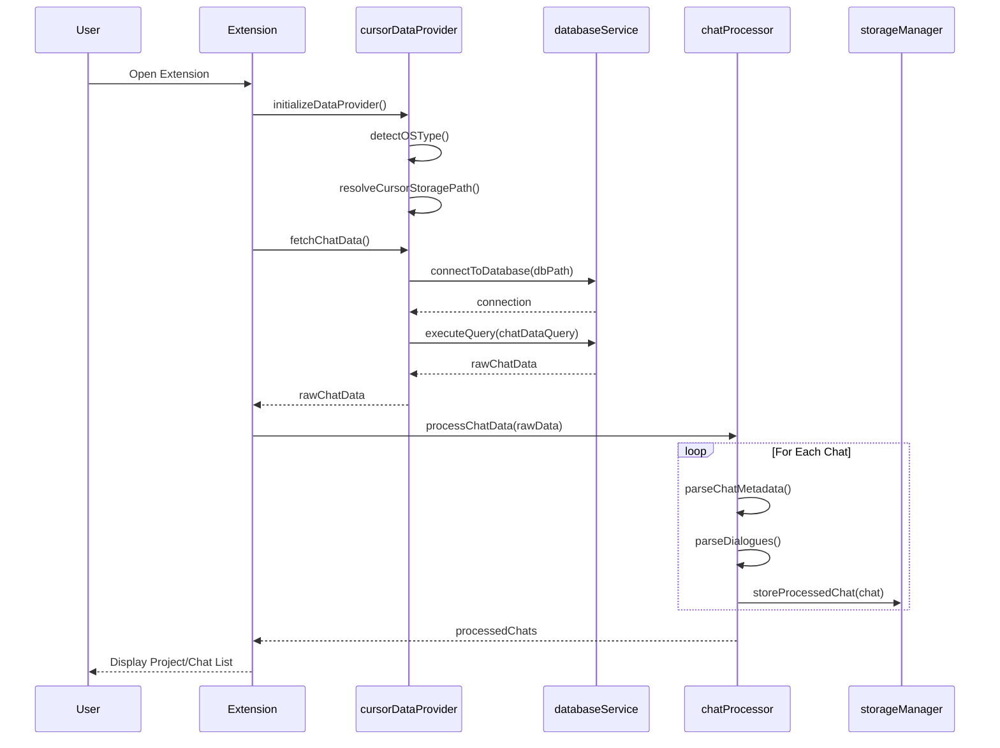
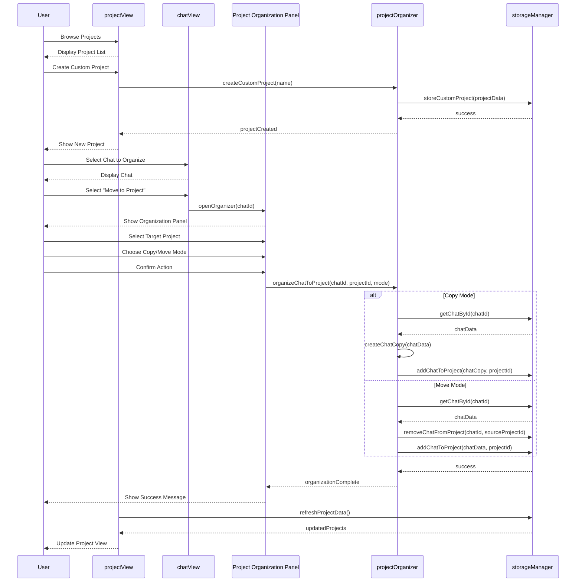
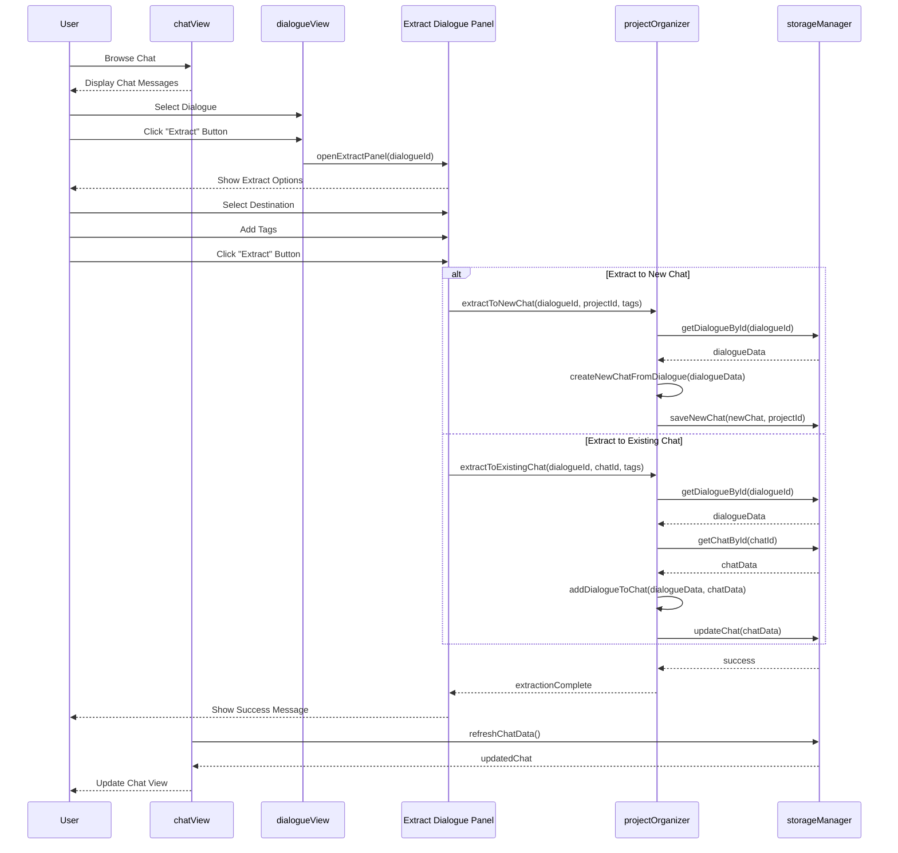
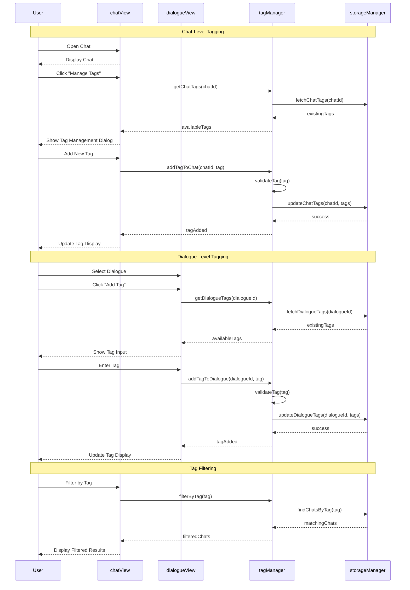
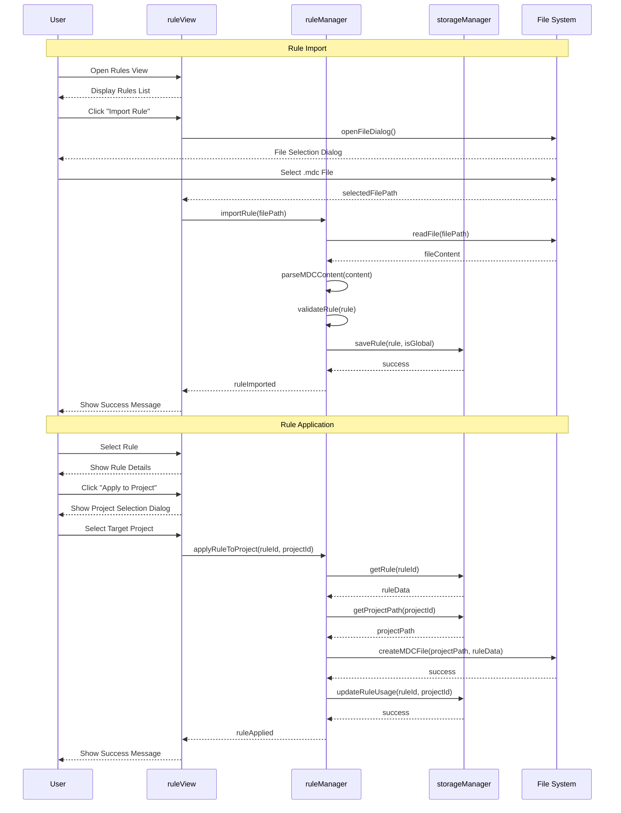
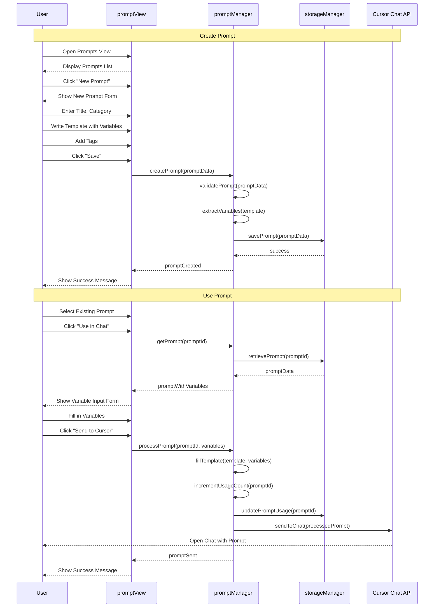
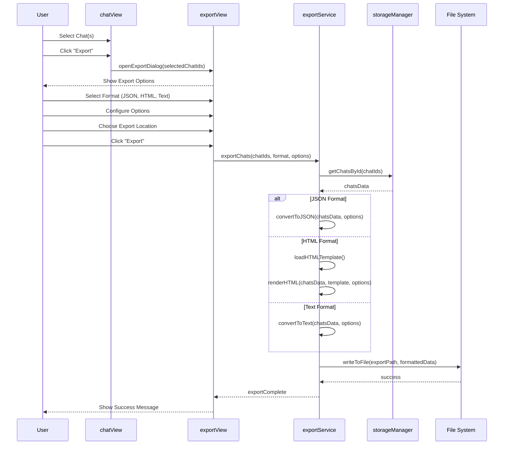

# Operational Workflows

This document provides detailed operational flows for the key user workflows in the Cursor Chat Manager extension, illustrating how different components interact and how the user experience unfolds for various tasks.

## 1. Chat Data Extraction and Processing Flow

This workflow shows how the extension extracts and processes chat data from Cursor's internal storage.



## 2. Custom Project Organization Flow

This workflow demonstrates how users can organize chats into custom projects.



## 3. Dialogue Extraction Flow

This workflow shows how individual dialogue entries can be extracted and organized.



## 4. Tagging System Flow

This workflow illustrates how the two-level tagging system operates.



## 5. Rule Management Flow

This workflow shows how rules are managed and applied across projects.



## 6. Prompt Management Flow

This workflow demonstrates how prompt templates are created, managed, and used.



## 7. Export Process Flow

This workflow shows how chat export functionality works.



## 8. Complete Workflow Integration

This diagram illustrates how all major components of the extension interact to deliver the complete functionality.

```mermaid
graph TB
    User([User])
    UI{UI Layer}
    Services{Business Logic}
    DataAccess{Data Access}
    CursorStorage[(Cursor Storage)]
    ExtStorage[(Extension Storage)]
    FileSystem[(File System)]
    
    User --> UI
    UI --> Services
    Services --> DataAccess
    DataAccess --> CursorStorage
    DataAccess --> ExtStorage
    DataAccess --> FileSystem
    
    subgraph UI Components
        ProjectView[Project View]
        ChatView[Chat View]
        DialogueView[Dialogue View]
        RuleView[Rule View]
        PromptView[Prompt View]
        ExportView[Export View]
    end
    
    subgraph Service Components
        ChatProc[Chat Processor]
        TagMgr[Tag Manager]
        ProjOrg[Project Organizer]
        RuleMgr[Rule Manager]
        PromptMgr[Prompt Manager]
        ExportSvc[Export Service]
    end
    
    subgraph Data Layer
        CursorData[Cursor Data Provider]
        StorageMgr[Storage Manager]
        DBService[Database Service]
    end
    
    UI --> ProjectView
    UI --> ChatView
    UI --> DialogueView
    UI --> RuleView
    UI --> PromptView
    UI --> ExportView
    
    Services --> ChatProc
    Services --> TagMgr
    Services --> ProjOrg
    Services --> RuleMgr
    Services --> PromptMgr
    Services --> ExportSvc
    
    DataAccess --> CursorData
    DataAccess --> StorageMgr
    DataAccess --> DBService
    
    ProjectView --> ProjOrg
    ChatView --> ChatProc
    ChatView --> TagMgr
    DialogueView --> ChatProc
    RuleView --> RuleMgr
    PromptView --> PromptMgr
    ExportView --> ExportSvc
    
    ChatProc --> CursorData
    ProjOrg --> StorageMgr
    TagMgr --> StorageMgr
    RuleMgr --> StorageMgr
    PromptMgr --> StorageMgr
    ExportSvc --> StorageMgr
    
    CursorData --> DBService
    StorageMgr --> DBService
    
    classDef user fill:#d0e0ff,stroke:#333,stroke-width:2px
    classDef ui fill:#ffe0d0,stroke:#333,stroke-width:1px
    classDef service fill:#d0ffe0,stroke:#333,stroke-width:1px
    classDef data fill:#fff0d0,stroke:#333,stroke-width:1px
    classDef storage fill:#f0f0f0,stroke:#333,stroke-width:1px
    
    class User user
    class ProjectView,ChatView,DialogueView,RuleView,PromptView,ExportView ui
    class ChatProc,TagMgr,ProjOrg,RuleMgr,PromptMgr,ExportSvc service
    class CursorData,StorageMgr,DBService data
    class CursorStorage,ExtStorage,FileSystem storage